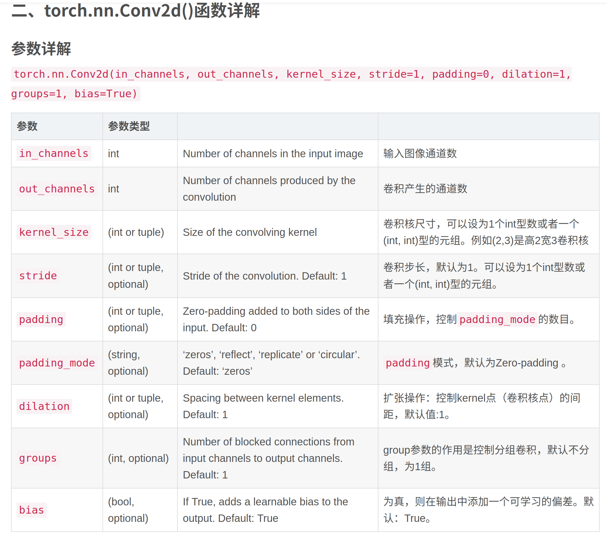
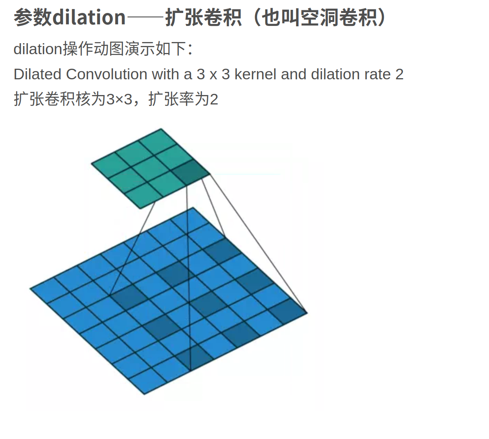
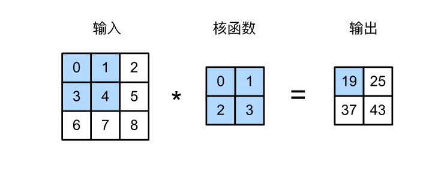
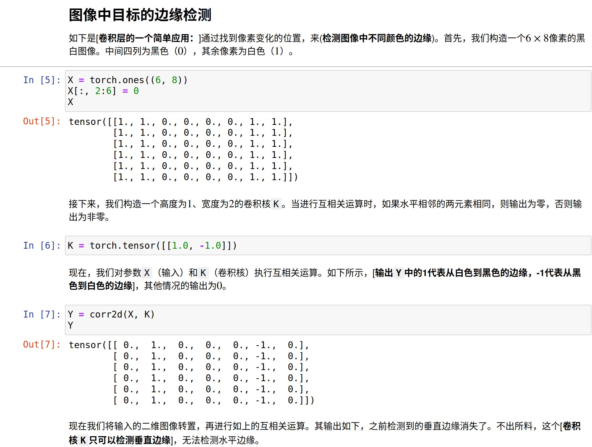
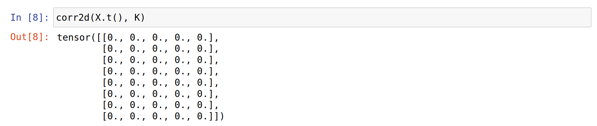
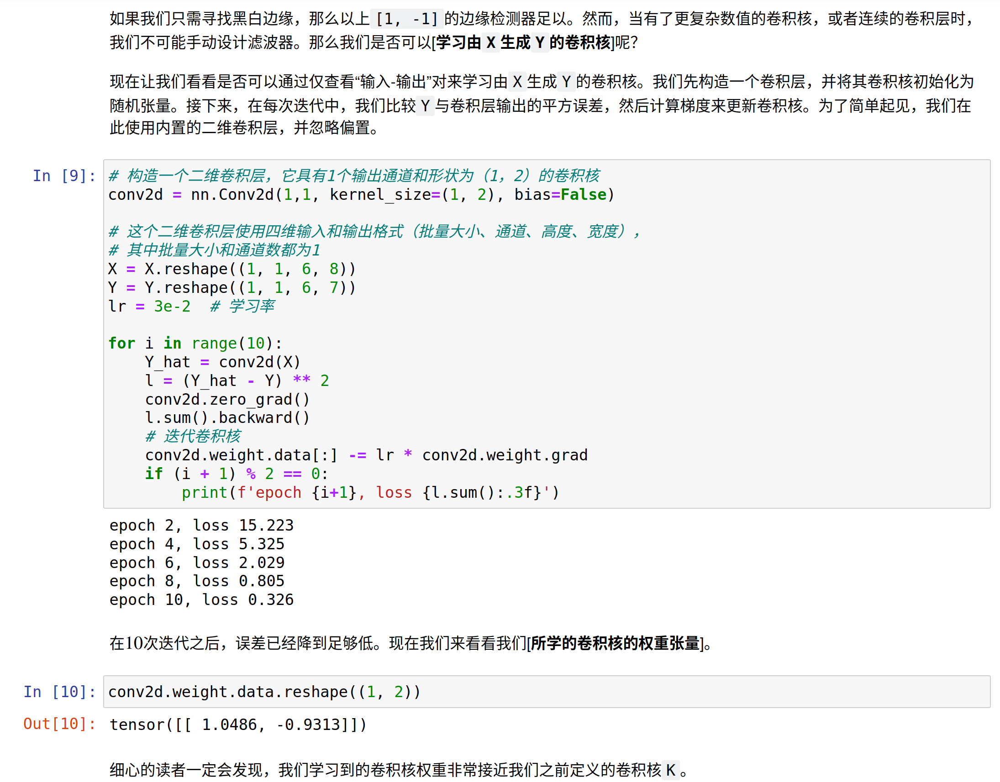
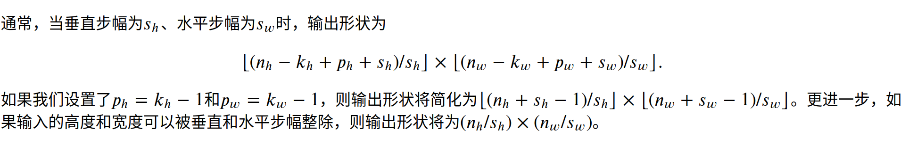
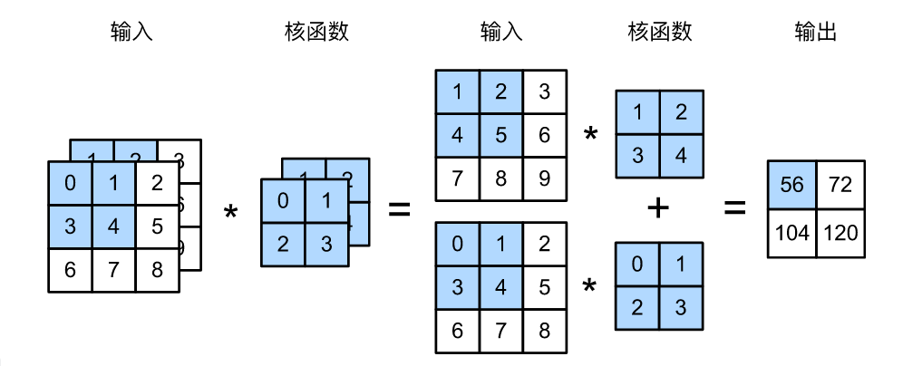
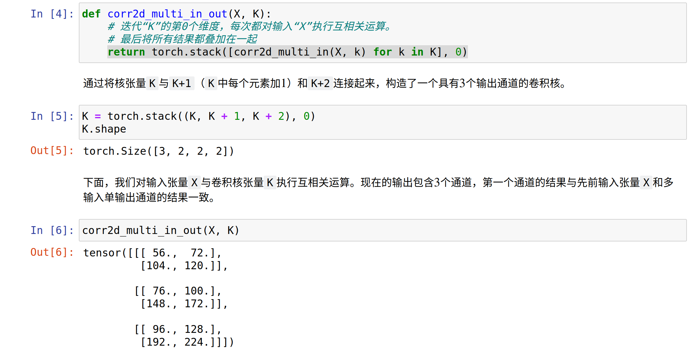
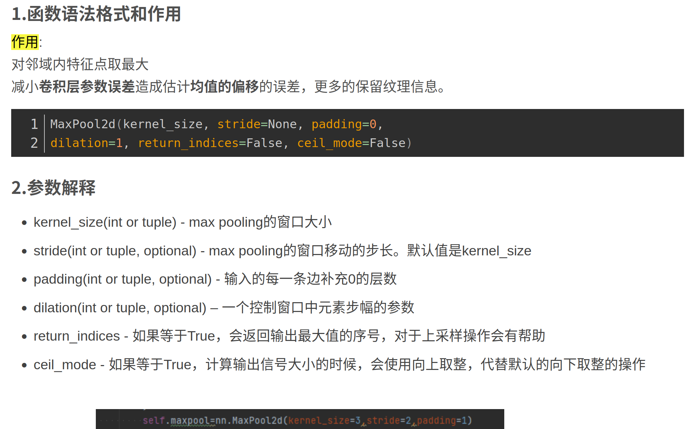

# CNN

***
>- 平移不变性（translation invariance）：不管检测对象出现在图像中的哪个位置，神经网络的前面几层应该对相同的图像区域具有相似的反应，即为“平移不变性”。
>- 局部性（locality）：神经网络的前面几层应该只探索输入图像中的局部区域，而不过度在意图像中相隔较远区域的关系，这就是“局部性”原则。最终，可以聚合这些局部特征，以在整个图像级别进行预测。
## 互相关运算
  
卷积层对输入和卷积核权重进行互相关运算，并在添加***标量偏置***之后产生输出。 所以，***卷积层中的两个被训练的参数是卷积核权重和标量偏置***。 就像我们之前随机初始化全连接层一样，在训练基于卷积层的模型时，我们也随机初始化卷积核权重。  

高度和宽度分别为ℎ和𝑤的卷积核可以被称为ℎ×𝑤卷积或ℎ×𝑤卷积核。 我们也将带有ℎ×𝑤卷积核的卷积层称为ℎ×𝑤卷积层。

### 下面例子很帮助理解！
  

## 要让机器自己学习卷积核

### 特征映射
卷积层有时被称为特征映射（feature map），因为它可以被视为一个输入映射到下一层的空间维度的转换器。 

### 感受野
在卷积神经网络中，对于某一层的任意元素𝑥，其感受野（receptive field）是指在前向传播期间可能影响𝑥计算的所有元素（来自所有先前层）。

### 填充
解决边缘像素丢失问题。  
我们添加𝑝ℎ行填充（大约一半在顶部，一半在底部）和𝑝𝑤列填充（左侧大约一半，右侧一半），则输出形状将为(𝑛ℎ−𝑘ℎ+𝑝ℎ+1)×(𝑛𝑤−𝑘𝑤+𝑝𝑤+1)。  
在许多情况下，我们需要设置𝑝ℎ=𝑘ℎ−1和𝑝𝑤=𝑘𝑤−1，使输入和输出具有相同的高度和宽度。 这样可以在构建网络时更容易地预测每个图层的输出形状。
### 步幅

### 多输入输出通道
#### 多输入

#### 多输出

### 1*1卷积
1×1卷积层通常用于调整网络层的通道数量和控制模型复杂性。

## 池化层
它具有双重目的：降低卷积层对位置的敏感性，同时降低对空间降采样表示的敏感性。

与卷积层类似，汇聚层运算符由一个固定形状的窗口组成，该窗口根据其步幅大小在输入的所有区域上滑动，为固定形状窗口（有时称为汇聚窗口）遍历的每个位置计算一个输出。 然而，不同于卷积层中的输入与卷积核之间的互相关计算，汇聚层不包含参数。 相反，池运算是确定性的，我们通常计算汇聚窗口中所有元素的最大值或平均值。这些操作分别称为最大汇聚层（maximum pooling）和平均汇聚层（average pooling）。

