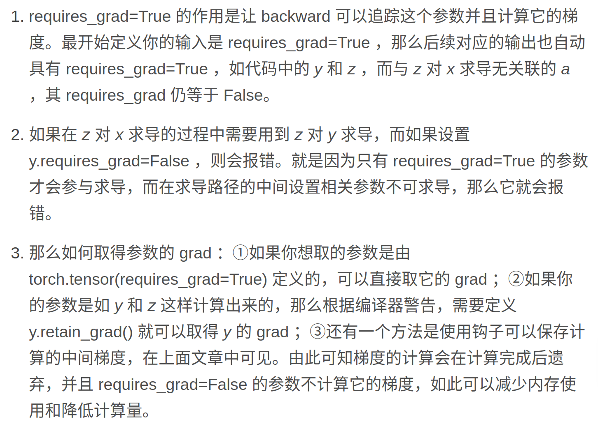
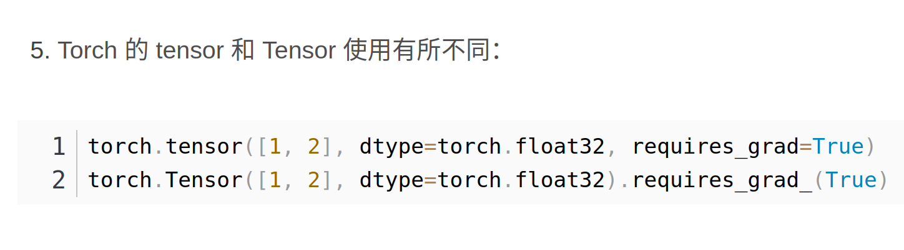
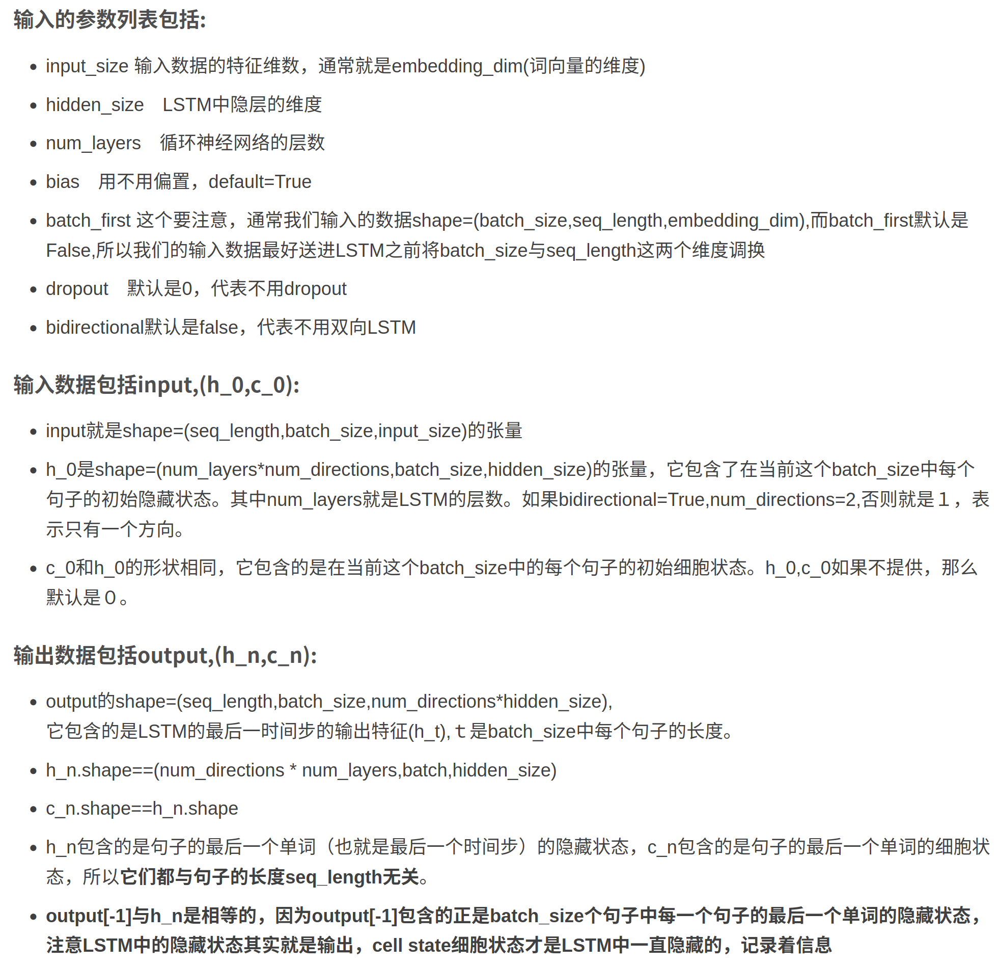

### torch.clip()


### 保存模型
``` python
#保存
torch.save(the_model, PATH)
#读取
model = torch.load(PATH)
```

### 保存参数
```python
torch.save(model.state_dict(),path)

# 测试所保存的模型
m_state_dict = torch.load('rnn.pt')
new_m = LSTM(input_size=1, hidden_size=10, num_layers=2).to(device)
new_m.load_state_dict(m_state_dict)

```
### params.require_grad(True)



### nn.GRU
[PyTorch nn.GRU 使用详解](https://blog.csdn.net/zdx1996/article/details/123532554?ops_request_misc=%257B%2522request%255Fid%2522%253A%2522169439446916777224437054%2522%252C%2522scm%2522%253A%252220140713.130102334..%2522%257D&request_id=169439446916777224437054&biz_id=0&utm_medium=distribute.pc_search_result.none-task-blog-2~all~top_click~default-2-123532554-null-null.142^v93^chatsearchT3_2&utm_term=nn.GRU&spm=1018.2226.3001.4187)

### nn.LSTM
