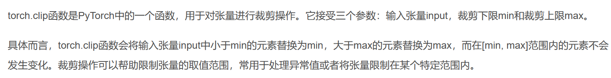
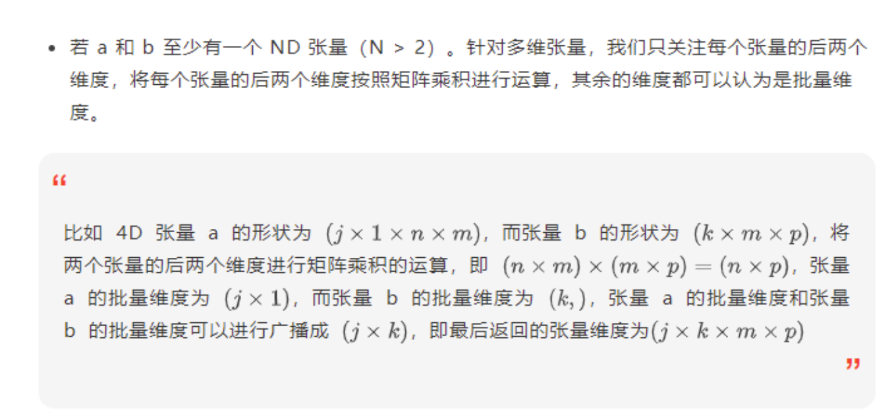
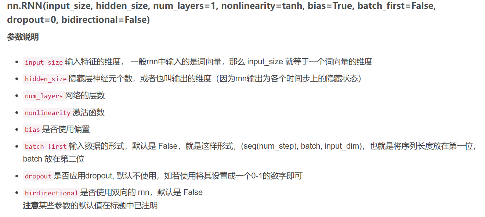

### torch.clip()


### 保存模型
``` python
#保存
torch.save(the_model, PATH)
#读取
model = torch.load(PATH)
```

### 保存参数
```python
torch.save(model.state_dict(),path)

# 测试所保存的模型
m_state_dict = torch.load('rnn.pt')
new_m = LSTM(input_size=1, hidden_size=10, num_layers=2).to(device)
new_m.load_state_dict(m_state_dict)

```

### torch.matmul(input, other, out = None)



### contiguous()
深拷贝，断开与初始tensor的连接  
[Pytorch中contiguous()函数理解](http://t.csdn.cn/yRlWH)

### weight_norm() 
深度神经网络的权重归一化（Weight Normalization，简称WN）是一种优化技术，它可以加速训练过程并提高模型的泛化能力。权重归一化的基本思想是将每个神经元的权重向量分解为两个因子：方向和大小。然后，对方向进行归一化，使其具有单位范数，而大小则作为一个可训练的参数。这样做的好处是，它可以减少梯度下降中的路径依赖性，从而避免局部最优和鞍点。此外，权重归一化还可以改善网络的初始化和正则化，因为它可以降低权重矩阵的条件数，并且可以与批次归一化或dropout等技术结合使用。  
[原文链接](https://blog.csdn.net/caroline_wendy/article/details/129724806)

### nn.RNN

*输入输出shape*  
1. input_shape = [时间步数, 批量大小, 特征维度] = [num_steps(seq_length), batch_size, input_dim]  
2. 在前向计算后会分别返回输出和隐藏状态h，其中输出指的是隐藏层在各个时间步上计算并输出的隐藏状态，它们通常作为后续输出层的输⼊。需要强调的是，该“输出”本身并不涉及输出层计算，形状为(时间步数, 批量大小, 隐藏单元个数)；隐藏状态指的是隐藏层在最后时间步的隐藏状态：当隐藏层有多层时，每⼀层的隐藏状态都会记录在该变量中；对于像⻓短期记忆（LSTM），隐藏状态是⼀个元组(h, c)，即hidden state和cell state(此处普通rnn只有一个值)隐藏状态h的形状为(层数, 批量大小,隐藏单元个数)

